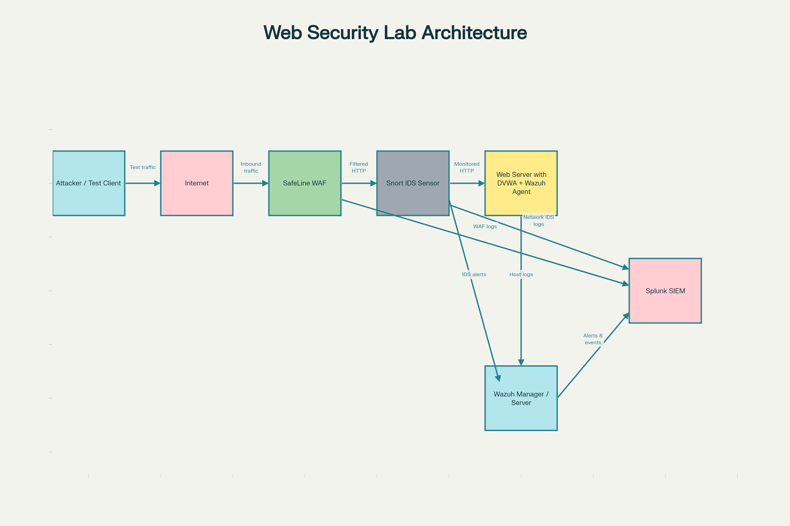

# Project Guardian: Multi-Layer Web Attack Detection & Defense Lab

This project is a hands-on web application defense lab that integrates SafeLine WAF, Snort IDS, Wazuh, Splunk, and DVWA to simulate real-world web attacks and end-to-end detection. It is designed to demonstrate how multiple security layers (WAF, IDS, HIDS, SIEM) work together to protect a deliberately vulnerable web application while giving blue-team style visibility across the full attack path.

---

## Architecture

The lab simulates an attacker sending HTTP requests to a vulnerable web application protected by multiple defensive components.

**High-level flow:**

- Attacker / test client sends HTTP(S) requests toward the DVWA web application.
- SafeLine WAF sits in front of DVWA, inspecting and filtering malicious web traffic.
- Snort IDS monitors network traffic between the WAF and the DVWA server.
- Wazuh agent on the DVWA server collects host and application logs.
- Wazuh Manager aggregates events from agents (and optionally Snort / WAF).
- Splunk SIEM ingests logs and alerts from Wazuh, Snort, and SafeLine for centralized analysis and dashboards.

---

## Components

- **DVWA (Damn Vulnerable Web Application)**  
  - Intentionally vulnerable PHP/MySQL web app.  
  - Used as the primary attack target to practice common web exploits (SQLi, XSS, command injection, etc.).

- **SafeLine WAF**  
  - Open-source web application firewall placed in front of DVWA.  
  - Inspects HTTP requests, blocks or challenges suspicious traffic, and generates WAF logs.

- **Snort IDS**  
  - Network intrusion detection system monitoring traffic between SafeLine WAF and the DVWA server.  
  - Uses rules/signatures to detect suspicious patterns and generate IDS alerts.

- **Wazuh (Agent + Manager)**  
  - Wazuh agent runs on the DVWA server to collect OS, application, and security logs.  
  - Wazuh Manager receives and analyzes events, providing host-level visibility and correlation.

- **Splunk SIEM**  
  - Central log management, search, and visualization platform.  
  - Ingests data from Wazuh (and optionally Snort and SafeLine WAF) to build dashboards, alerts, and investigations.

---

## Lab Workflow

1. **Generate traffic and attacks**
   - Use a browser or Kali/testing VM to browse DVWA through the SafeLine WAF endpoint.
   - Perform common web attacks against DVWA (e.g., SQL injection, XSS, brute force, command injection).

2. **Traffic inspection and detection**
   - SafeLine WAF inspects incoming HTTP requests and blocks or flags malicious payloads.
   - Snort IDS monitors the same traffic on the internal segment and triggers IDS alerts for known attack signatures.
   - The DVWA server logs web requests and application behavior; Wazuh agent collects these logs and forwards them to the Wazuh Manager.

3. **Log collection and correlation**
   - Wazuh Manager normalizes and enriches events from agents and, where configured, Snort and SafeLine log sources.
   - Splunk ingests:
     - Wazuh alerts and events (via forwarder/integration).
     - Optional direct feeds from Snort IDS.
     - Optional WAF logs from SafeLine.
   - Splunk indexes all events, enabling correlation across WAF, IDS, and host telemetry.

4. **Analysis and visualization**
   - Use Splunk searches to answer questions like:
     - Which IPs generated the most WAF or Snort alerts?
     - Which DVWA vulnerabilities are being exploited?
     - How many host-level events were associated with a single attack campaign?
   - Build dashboards to visualize:
     - Attack sources (IPs, countries).
     - Top rules triggered (WAF, Snort, Wazuh).
     - Timeline of attacks versus detections and blocks.

5. **Tuning and detection engineering**
   - Adjust SafeLine WAF rules to reduce false positives and strengthen protection.
   - Tune or add Snort rules for specific DVWA attack patterns.
   - Modify Wazuh decoders/rules to better parse and alert on DVWA, WAF, and Snort events.
   - Create or refine Splunk alerts for high-fidelity, actionable detections.

---

## Learning Objectives

- Understand how WAF, IDS, HIDS, and SIEM components complement each other in a layered defense.
- Practice building detection use cases for web application attacks using real tools.
- Gain experience onboarding logs into a SIEM and creating meaningful visualizations and alerts.
- Build a portfolio-ready security lab that demonstrates blue-team skills and modern monitoring practices.

---
